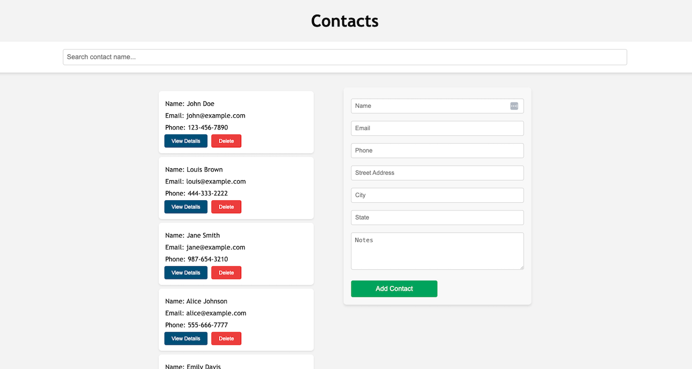
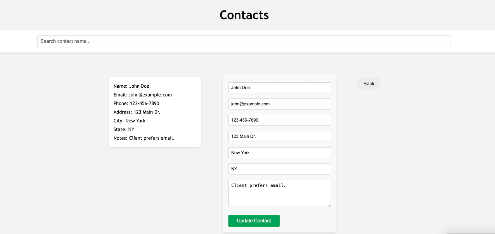

# Contact List App

## Project Overview
This is a full-stack **Contact List App** built using the **PERN** stack (PostgreSQL, Express, React, and Node.js). The app allows users to create, view, update, and delete contact information, with additional features like filtering the contact list.

### Features
- View a list of contacts.
- Search for contacts by name using a search bar.
- Add new contacts with validation.
- Edit existing contact details.
- Delete contacts.
- Responsive design with simple media queries.
- Error handling for form submissions and server-side errors.

## Technologies Used
- **Frontend**: React, JavaScript, CSS
- **Backend**: Node.js, Express
- **Database**: PostgreSQL
- **Testing**: Jest, React Testing Library
- **API**: RESTful API with full CRUD functionality

## Preview





## Installation and Setup

### Prerequisites
- **Node.js** installed (version 14+)
- **PostgreSQL** installed and running
- **npm** package manager

### Backend Setup
1. Clone the repository:
   ```bash
   git clone git@github.com:MBHunter88/-techtonica-assignments.git
   ```

2. Navigate to the project directory and install backend dependencies:
   ```bash
   cd contact-list-app/server
   npm install
   ```

3. Set up the PostgreSQL database:
   - Create a PostgreSQL database.
   - Run the migration script to set up the necessary tables:
     ```bash
     psql -U your-username -d your-database-name -f db/schema.sql
     ```

4. Create a `.env` file in the `server` directory with the following content:
   ```bash
   DATABASE_URI="postgresql://<user>:<password>@localhost/<database>"
   PORT=8080
   ```

5. Start the backend server:
   ```bash
   npm start
   ```

### Frontend Setup
1. Navigate to the frontend directory:
   ```bash
   cd ../client
   ```

2. Install frontend dependencies:
   ```bash
   npm install
   ```

3. Start the frontend development server:
   ```bash
   npm run dev
   ```

### Running Tests
To run tests for both the frontend and backend, you can use the following commands:

- Backend tests:
  ```bash
  cd server
  npm test
  ```

- Frontend tests:
  ```bash
  cd client
  npm test
  ```

## API Endpoints
- **GET** `/contacts`: Retrieve all contacts (excluding notes).
- **GET** `/contacts/:id`: Retrieve individual contact details (including address and notes).
- **POST** `/contacts`: Add a new contact.
- **PUT** `/contacts/:id`: Update an existing contact.
- **DELETE** `/contacts/:id`: Delete a contact.

## Error Handling
The app has comprehensive error handling on both the frontend and backend:
- **Frontend**: Displays error messages if form validation fails.
- **Backend**: Returns clear error responses for invalid input or database errors.

## Media Queries and Responsiveness
The app is fully responsive and adapts to different screen sizes using media queries. On smaller screens, the contact list and form stack vertically.

## Challenges Faced
Some challenges I encountered during development included:
- Handling form validation and ensuring a smooth user experience with error messages.
- Implementing the search functionality to efficiently filter contacts in real time.
- Time constraints: this app was built with the help of previously used code due to a 2-day time constraint.

## Future Improvements
- Add more advanced form validation including error modals for incomplete submissions and integer validation for phone input. 
- Implement sorting or filtering options based on additional criteria.

## License
This project is licensed under the MIT License.
